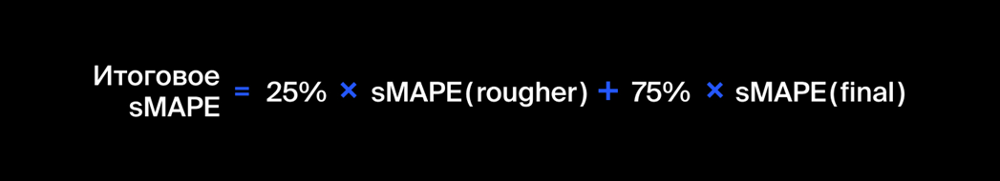

# Яндекс Практикум. Курс "Data Science". Проект "Восстановление золота из руды".

# 1. Описание проекта. План работы.

Для золотодобывающего горно-обогатительного комбината (ГОК) требуется улучшить производственный процесс, чтобы снизить издержки. Построим модель машинного обучения, которая поможет оптимизировать процесс обогащения золота в золотосодержащих рудах.

Нам предоставлены данные с параметрами добычи руды и многоступенчатой очистки золота.

Шаги для выполнения проекта:

1. Подготовить данные.
2. Провести исследовательский анализ данных.
3. Построить и обучить модель.

## 1.1. Схема технологического процесса.

Когда добытая руда проходит первичную обработку, получается дроблёная смесь. Её отправляют на флотацию (обогащение) и двухэтапную очистку. Опишем каждую стадию:

### 1. Флотация.

Во флотационную установку подаётся смесь золотосодержащей руды. После обогащения получается черновой концентрат и «отвальные хвосты», то есть остатки продукта с низкой концентрацией ценных металлов. *На стабильность этого процесса влияет непостоянное и неоптимальное физико-химическое состояние флотационной пульпы (смеси твёрдых частиц и жидкости)*.

### 2. Очистка.

Черновой концентрат проходит две очистки. На выходе получается финальный концентрат и новые отвальные хвосты.

## 1.2 Обозначения, применяемые в техпроцессе.

* Rougher feed — исходное сырье
* Rougher additions (или reagent additions) — флотационные реагенты: Xanthate, Sulphate, Depressant
    * Xanthate **— ксантогенат (промотер, или активатор флотации);
    * Sulphate — сульфат (на данном производстве сульфид натрия);
    * Depressant — депрессант (силикат натрия).
* Rougher process (англ. «грубый процесс») — флотация
* Rougher tails — отвальные хвосты
* Float banks — флотационная установка
* Cleaner process — очистка
* Rougher Au — черновой концентрат золота
* Final Au — финальный концентрат золота

Параметры этапов:

* air amount — объём воздуха
* fluid levels — уровень жидкости
* feed size — размер гранул сырья
* feed rate — скорость подачи

## 1.3. Вводная информация.

Данные геологоразведки трёх регионов находятся в файлах:

* gold_recovery_train_new.csv
* gold_recovery_test_new.csv
* gold_recovery_full_new.csv

Данные индексируются датой и временем получения информации (признак date). **Соседние по времени параметры часто похожи.**

Некоторые параметры недоступны, потому что замеряются и/или рассчитываются значительно позже. Из-за этого в тестовой выборке отсутствуют некоторые признаки, которые могут быть в обучающей. Также в тестовом наборе нет целевых признаков.

Исходный датасет содержит обучающую и тестовую выборки со всеми признаками.

В нашем распоряжении сырые данные: их просто выгрузили из хранилища. Прежде чем приступить к построению модели, проверьте по нашей инструкции их на корректность.

## 1.4. Цель проекта.

Подготовить прототип модели машинного обучения для компании «Цифра».

Модель должна предсказать коэффициент восстановления золота из золотосодержащей руды и поможет оптимизировать производство, чтобы не запускать предприятие с убыточными характеристиками.

Для прогноза коэффициента нужно **найти долю золота в концентратах и хвостах**. Причём важен не только финальный продукт, но и черновой концентрат.

## 1.5. Задачи проекта.

**1.Подготовить данные:**

1.1. Открыть файлы:

* gold_recovery_train_new.csv,
* gold_recovery_test_new.csv,
* gold_recovery_full_new.csv.

и изучить их.

1.2. Проверить, что эффективность обогащения рассчитана правильно. Вычислить её на обучающей выборке для признака **rougher.output.recovery**. Найти MAE между нашими расчётами и значением признака. Описать выводы.

Смоделировать процесс восстановления золота из золотосодержащей руды. Эффективность обогащения рассчитывается по формуле:

где:

* **C** — доля золота в концентрате после флотации/очистки (**'Сoncentrate'**);
* **F** — доля золота в сырье/концентрате до флотации/очистки (**'Float'**);
* **T** — доля золота в отвальных хвостах после флотации/очистки (**'Tail'**).

1.3. Проанализировать признаки, недоступные в тестовой выборке. Что это за параметры? К какому типу относятся?

1.4. Провести предобработку данных.

**2. Проанализировать данные:**

2.1. Посмотреть, как меняется концентрация металлов (Au, Ag, Pb) на различных этапах очистки. Описать выводы.

2.2. Сравнить распределения размеров гранул сырья на обучающей и тестовой выборках. Если распределения сильно отличаются друг от друга, оценка модели будет неправильной.

2.3. Исследовать суммарную концентрацию всех веществ на разных стадиях: в сырье, в черновом и финальном концентратах.

**3. Построить модель:**

3.1. Написать функцию для вычисления итоговой sMAPE.

3.2. Обучить разные модели и оценить их качество кросс-валидацией. Выбрать лучшую модель и проверить её на тестовой выборке. Описать выводы.

## 1.6. Наименование признаков.

Наименование признаков должно быть такое:

[этап].[тип_параметра].[название_параметра] Пример: rougher.input.feed_ag Возможные значения для блока [этап]:

* rougher — флотация
* primary_cleaner — первичная очистка
* secondary_cleaner — вторичная очистка
* final — финальные характеристики

Возможные значения для блока [тип_параметра]:

* input — параметры сырья
* output — параметры продукта
* state — параметры, характеризующие текущее состояние этапа
* calculation — расчётные характеристики

Целевой признак:

* final.calculation.concentrate_au — итоговые рассчитанные содержания золота в концентрате.

## 1.7. Проверяемые гипотезы.

**Нужно спрогнозировать сразу две величины:**

1. Эффективность обогащения чернового концентрата **rougher.output.recovery**.

2. Эффективность обогащения финального концентрата **final.output.recovery**.

Итоговая метрика складывается из двух величин:

## 1.8. Метрика качества.

Для решения задачи введём новую метрику качества — sMAPE (англ. Symmetric Mean Absolute Percentage Error, «симметричное среднее абсолютное процентное отклонение»).

Она похожа на MAE, но выражается не в абсолютных величинах, а в относительных. Почему симметричная? Она одинаково учитывает масштаб и целевого признака, и предсказания.

Метрика sMAPE вычисляется так:

# 2. Общий вывод

По результатам исследования можно отметить следующие факты и сделать следующие выводы:

1. От компании «Цифра» получены данные с контрольными измерениями по ходу технологического процесса:
* концентраций Au, Ag, Pb от исходного сырья до конечного концентрата,
* информация по составу и количеству флотационных реагентов,
* другим производственным характеристикам.
2. Данные подготовлены для дальнейшего анализа.
3. Проверена и подтверждена правильность расчёта эффективности обогащения.
4. Исследована динамика изменения содержаний металлов (Au, Ag, Pb) в рудных материалах на всех стадиях производственного процесса. Отмечено:
* Концентрации Au и Pb увеличиваются.
* Серебро теряется. Видимо на предприятии нет задачи по выделению серебра из руды. Упущенная выгода при этом оценена в 0.5 млрд рублей ежегодно.
5. Изучено такая характеристика, как размер гранул рудных материалов ‘До’ и ‘После’ процесса флотации. В среднем их размер уменьшается в 10 раз.
6. Исследована динамика изменения содержаний металлов (Au, Ag, Pb) в так называемых ‘хвостах’. т.е. отходах. Отмечено, что в отходы попадают материалы с очень большими содержаниями и золота, и серебра. Это информация для технологов.
7. По динамике суммарного содержания всех металлов на разных стадиях очистки и концентрирования металлов можно говорить о том, что суммарная концентрация всех трех металлов увеличивается с каждым этапом техпроцесса, а следовательно, очистка металлов проводится успешно.
8. По распределению эффективности обогащения сырья и готового концентрата сделано заключение, что процесс флотации эффективнее, чем последующая очистка.
9. Созданы функции для расчёта метрик: sMAPE и Итоговое_sMAPE.
10. Собраны обучающая и тестовая выборки для построения моделей.
11. Построена модель 'Дерево решений' c подбором параметра глубины дерева. Итоговое_sMAPE наилучшей модели "Дерево решений" c GridSearchCV" равно 8.619.
12. Создана модель 'Cлучайного леса' c автоматическим подбором параметров глубина дерева и количество деревьев. Итоговое_sMAPE наилучшей модели 'Cлучайного леса' c GridSearchCV" равно 8.339.
13. Построена модель 'Линейной регрессии'. Итоговое_sMAPE равно 10.2.
14. В качестве лучшей выбрана модель 'Cлучайного леса' c ‘Итоговое_sMAPE’ = 8.339.
15. Лучшая модель проверена на тестовой выборке. ‘Итоговое_sMAPE’ = 9.029.
16. Проведена проверка модели на адекватность. ‘Итоговое_sMAPE’ = 9.487, что больше, чем на тестовой выборке. Ошибка на тестовой выборке разумная.

[Вернутся к общему списку](../README.md)
