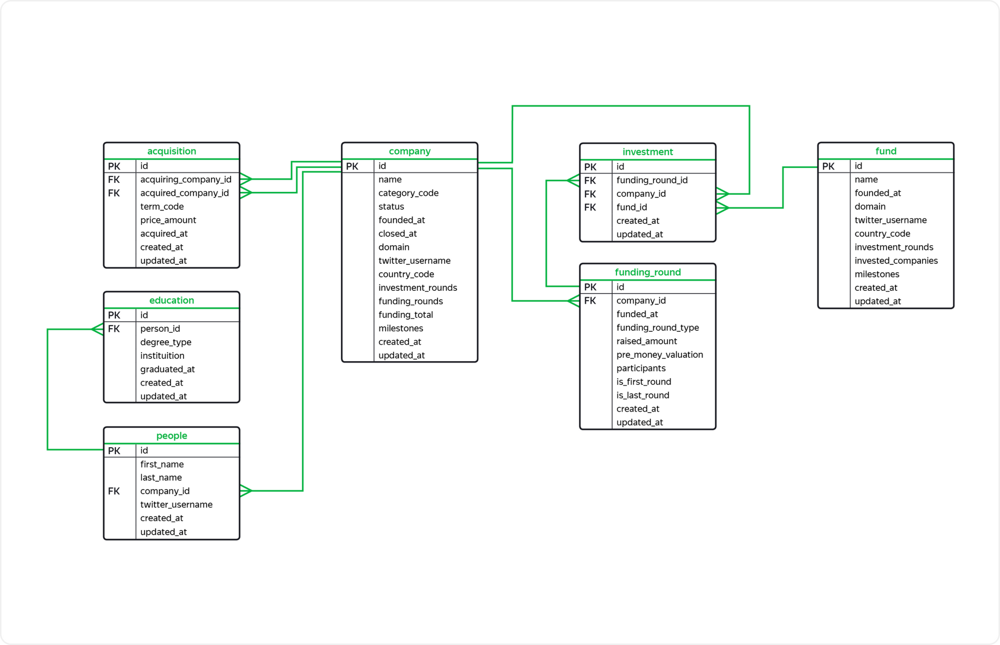

# Яндекс Практикум. Курс "Data Science". Проект "Анализ данных о фондах и инвестициях".

# 1  Задание на проект.

## 1.1. Описание проекта.

Мы работаем с базой данных, которая хранит информацию о венчурных фондах и инвестициях в компании-стартапы. Эта база данных основана на датасете Startup Investments(https://www.kaggle.com/justinas/startup-investments), опубликованном на популярной платформе для соревнований по исследованию данных Kaggle.

Анализировать рынок инвестиций без подготовки может быть непросто. Поэтому сначала познакомимся с важными понятиями, которые вам встретятся в работе с базой данных.

*Венчурные фонды* — это финансовые организации, которые могут позволить себе высокий риск и инвестировать в компании с инновационной бизнес-идеей или разработанной новой технологией, то есть в стартапы. Цель венчурных фондов — в будущем получить значительную прибыль, которая в разы превысит размер их трат на инвестиции в компанию. Если стартап подорожает, венчурный фонд может получить долю в компании или фиксированный процент от её выручки.

Чтобы процесс финансирования стал менее рискованным, его делят на стадии — *раунды*. Тот или иной раунд зависит от того, какого уровня развития достигла компания.

Первые этапы — *предпосевной* и *посевной* раунды. Предпосевной раунд предполагает, что компания как таковая ещё не создана и находится в стадии замысла. Следующий — посевной — раунд знаменует рост проекта: создатели компании разрабатывают бизнес-модель и привлекают инвесторов.

Если компании требуется ментор или наставник — она привлекает бизнес-ангела. Бизнес-ангелы — инвесторы, которые помимо финансовой поддержки предлагают экспертную помощь. Такой раунд называют ангельским.

Когда стартап становится компанией с проверенной бизнес-моделью и начинает зарабатывать самостоятельно, предложений инвесторов становится больше. Это раунд A, а за ним следуют и другие: B, C, D — на этих этапах компания активно развивается и готовится к IPO.

Иногда выделяют венчурный раунд — финансирование, которое могло поступить от венчурного фонда на любом этапе: начальном или более позднем.

Работу с новой базой данных начнём с изучения схемы:

## 1.2. Описание данных.

Все данные хранятся в следующих таблицах:

1. `acquisition`

Содержит информацию о покупках одних компаний другими.

Таблица включает такие поля:

* первичный ключ `id` — идентификатор или уникальный номер покупки;
* внешний ключ `acquiring_company_id` — ссылается на таблицу `company` — идентификатор компании-покупателя, то есть той, что покупает другую компанию;
* внешний ключ `acquired_company_id` — ссылается на таблицу `company` — идентификатор компании, которую покупают;
* `term_code` — способ оплаты сделки:
    * `cash` — наличными;
    * `stock` — акциями компании;
    * `cash_and_stock` — смешанный тип оплаты: наличные и акции.
* `price_amount` — сумма покупки в долларах;
* `acquired_at` — дата совершения сделки;
* `created_at` — дата и время создания записи в таблице;
* `updated_at` — дата и время обновления записи в таблице.

2. `company`
Содержит информацию о компаниях-стартапах.

* первичный ключ `id` — идентификатор, или уникальный номер компании;
* `name` — название компании;
* `category_code` — категория деятельности компании, например:
    * `news` — специализируется на работе с новостями;
    * `social` — специализируется на социальной работе.
* `status` — статус компании:
    * `acquired` — приобретена;
    * `operating` — действует;
    * `ipo` — вышла на IPO;
    * `closed` — перестала существовать.
* `founded_at` — дата основания компании;
* `closed_at` — дата закрытия компании, которую указывают в том случае, если компании больше не существует;
* `domain` — домен сайта компании;
* `twitter_username` — название профиля компании в твиттере;
* `country_code` — код страны, например, `USA` для США, `GBR` для Великобритании;
* `investment_rounds` — число раундов, в которых компания участвовала как инвестор;
* `funding_rounds` — число раундов, в которых компания привлекала инвестиции;
* `funding_total` — сумма привлечённых инвестиций в долларах;
* `milestones` — количество важных этапов в истории компании;
* `created_at` — дата и время создания записи в таблице;
* `updated_at` — дата и время обновления записи в таблице.

3. `education`

Хранит информацию об уровне образования сотрудников компаний.

* первичный ключ `id` — уникальный номер записи с информацией об образовании;
* внешний ключ `person_id` — ссылается на таблицу `people` — идентификатор человека, информация о котором представлена в записи;
* `degree_type` — учебная степень, например:
    * `BA` — Bachelor of Arts — бакалавр гуманитарных наук;
    * `MS` — Master of Science — магистр естественных наук.
* `instituition` — учебное заведение, название университета;
* `graduated_at` — дата завершения обучения, выпуска;
* `created_at` — дата и время создания записи в таблице;
* `updated_at` — дата и время обновления записи в таблице.

4. `fund`

Хранит информацию о венчурных фондах.

* первичный ключ `id` — уникальный номер венчурного фонда;
* `name` — название венчурного фонда;
* `founded_at` — дата основания фонда;
* `domain` — домен сайта фонда;
* `twitter_username` — профиль фонда в твиттере;
* `country_code` — код страны фонда;
* `investment_rounds` — число инвестиционных раундов, в которых фонд принимал участие;
* `invested_companies` — число компаний, в которые инвестировал фонд;
* `milestones` — количество важных этапов в истории фонда;
* `created_at` — дата и время создания записи в таблице;
* `updated_at` — дата и время обновления записи в таблице.

5. `funding_round`

Содержит информацию о раундах инвестиций.

* первичный ключ `id` — уникальный номер инвестиционного раунда;
* внешний ключ `company_id` — ссылается на таблицу `company` — уникальный номер компании, участвовавшей в инвестиционном раунде;
* `funded_at` — дата проведения раунда;
* `funding_round_type` — тип инвестиционного раунда, например:
    * `venture` — венчурный раунд;
    * `angel` — ангельский раунд;
    * `series_a` — раунд А.
* `raised_amount` — сумма инвестиций, которую привлекла компания в этом раунде в долларах;
* `pre_money_valuation` — предварительная, проведённая до инвестиций оценка стоимости компании в долларах;
* `participants` — количество участников инвестиционного раунда;
* `is_first_round` — является ли этот раунд первым для компании;
* `is_last_round` — является ли этот раунд последним для компании;
* `created_at` — дата и время создания записи в таблице;
* `updated_at` — дата и время обновления записи в таблице.

6. `investment`

Содержит информацию об инвестициях венчурных фондов в компании-стартапы.

* первичный ключ `id` — уникальный номер инвестиции;
* внешний ключ `funding_round_id` — ссылается на таблицу `funding_round` — уникальный номер раунда инвестиции;
* внешний ключ `company_id` — ссылается на таблицу `company` — уникальный номер компании-стартапа, в которую инвестируют;
* внешний ключ `fund_id` — ссылается на таблицу `fund` — уникальный номер фонда, инвестирующего в компанию-стартап;
* `created_at` — дата и время создания записи в таблице;
* `updated_at` — дата и время обновления записи в таблице.

7. `people`

Содержит информацию о сотрудниках компаний-стартапов.

* первичный ключ `id` — уникальный номер сотрудника;
* `first_name` — имя сотрудника;
* `last_name` — фамилия сотрудника;
* внешний ключ `company_id` — ссылается на таблицу `company` — уникальный номер компании-стартапа;
* `twitter_username` — профиль сотрудника в твиттере;
* `created_at` — дата и время создания записи в таблице;
* `updated_at` — дата и время обновления записи в таблице.

## 1.3. Цель проекта.

Провести исследование с целью проанализировать данные о фондах и инвестициях в компании-стартапы и написать запросы к базе данных.

Результаты исследования позволят детальнее изучить экосистему стартапов.

# 2 Общие выводы.

В ходе исследования удалось получить следующие результаты:

1. Обнаружено, что закрылось 2_584 компании.
2. Общая сумма сделок по покупке одних компаний другими в период с 2011 по 2013 год включительно составляет 137,762 млрд. долларов.
3. Больше всего привлечено инвестиций в следующих странах: США, Великобритания, Китай, Канада, Индия.

|country_code|sum|
|---|---|
|USA|3.10588e+11|
|GBR|1.77056e+10|
|CHN|1.06897e+10|
|CAN|9.86636e+09|
|IND|6.14141e+09|

4. Создано поле с категориями:
* Для фондов, которые инвестируют в 100 и более компаний, назначьте категорию `high_activity`.
* Для фондов, которые инвестируют в 20 и более компаний до 100, назначьте категорию `middle_activity`.
* Если количество инвестируемых компаний фонда не достигает 20, назначьте категорию `low_activity`.
5. Список из 5 стран, в которых находятся фонды, которые чаще всего инвестируют в стартапы:

|country_code|min|max|avg|
|---|---|---|---|
|BGR|25|35|30|
|CHL|29|29|29|
|UKR|8|10|9|
|LTU|5|5|5|
|IRL|4|5|4.5|  

6. Список компаний с максимальным числом уникальных учебных заведений, которые окончили её сотрудники:   

|name|count|
|---|---|
|Google|167|
|Yahoo!|115|
|Microsoft|111|
|Knight Foundation|74|
|Comcast|66|

7. Cреднее число всех учебных заведений, которые окончили сотрудники разных компаний:

|avg|
|---|
|1.41509|

8. Среднее число всех учебных заведений, которые окончили сотрудники Facebook*:

|avg|
|---|
|1.51111|

Таким образом отмечаем:
* По сумме привлечённых инвестиций лидируют компании из развитых стран.
* Самые активных инвесторы из развивающиеся страны.
* По числу учебных заведений, которые окончили её сотрудники, лидируют IT-компании.

[Вернутся к общему списку](../README.md)
